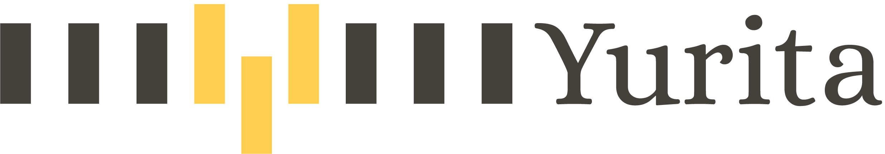

# Yurita

Yurita is an open source project for developing large scale anomaly detection models
[Site](https://github.paypal.com/pages/EservDataProcessing/Yurita/)

## Getting Started

## Contributing to Yurita

Thank you very much for contributing to Yurita. Please read the [contribution guidelines](CONTRIBUTING.md) for the process.

## License

Yurita is licensed under the [Apache License, v2.0](LICENSE.txt)
