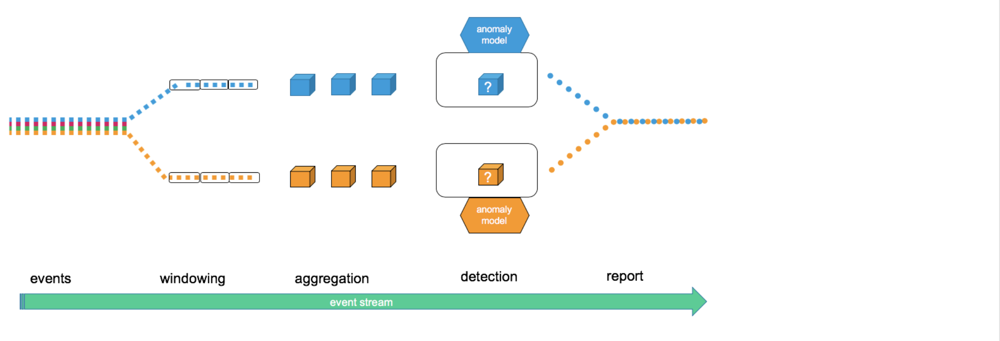

<!--
 Copyright 2019 PayPal Inc

  Licensed under the Apache License, Version 2.0 (the "License");
  you may not use this file except in compliance with the License.
  You may obtain a copy of the License at

      http://www.apache.org/licenses/LICENSE-2.0

  Unless required by applicable law or agreed to in writing, software
  distributed under the License is distributed on an "AS IS" BASIS,
  WITHOUT WARRANTIES OR CONDITIONS OF ANY KIND, either express or implied.
  See the License for the specific language governing permissions and
  limitations under the License.
-->

# Data Flow
Each component in the API was designed to be pluggable allowing users to mix and match between the framework's built-in components and user provided custom components

1. Events: Input Dataset each record has a timestamp

2. Windowing: Events are grouped into windows for processing e.g. 1 hour, 24 hours

3. Aggregation: Data structure and processing of the grouped events collected in each window

4. Anomaly Detection Model: Analyzes an aggregation and decides if it’s an anomaly, produces reports

5. Reports: Output Dataset of an anomaly detection analysis, produced when examining each aggregation
