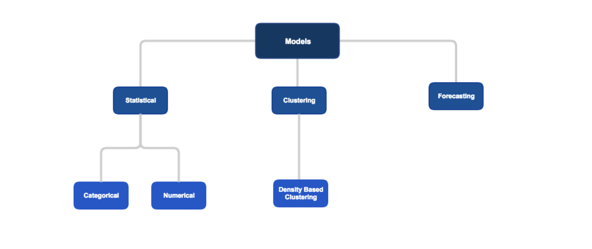
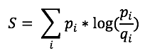
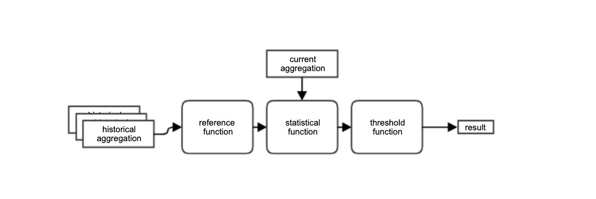

Users can choose to plugin custom models or use built-in generic base models. As development progress more and more generic base models will be added.



# Categorical Models

Data values are divided to clear categories, check which values in a given column showed abnormal behavior. the model computes an anomaly score and also outputs each value's contribution to that score in order to extract the cause of the anomaly.
Users can provide the statistical function for the model or use built-in functions.

___Built-in statistical functions:___

|function|description|
|--------|-----------|
|Entropy||

The model allows also to plug-in a function how to merge the reference windows into a single reference aggregation before comparing it to the current aggregation that we want to evaluate. It allows also to plugin-in a function that will decide if the statistical result is an anomaly.



___Built-in reference aggregation functions:___

|function|description|
|--------|-----------|
|avgRef|creates a reference aggregation that is the average for each value in the historical references|

___Built-in threshold functions:___

|function|description|
|--------|-----------|
|statResultThreshold|decides if the statistical function result crosses a threshold then classify it as an anomaly|

Creating a model with a built-in function:

```
val categoricalPipes = PipelineBuilder()
  .onColumns(…)
  .buildCategoricalModel(
    Functions.Categorical.avgRef,
    Functions.Categorical.entropy,
    Functions.statResultThreshold(3.0))
```

creating a model with a custom function:

```
val categoricalPipes = PipelineBuilder()
  .onColumns(…)
  .buildCategoricalModel(
    Functions.Categorical.avgRef,
    myCustomFunction,
    Functions.statResultThreshold(3.0))
```


