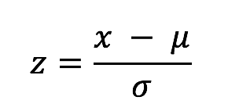

<!--
 Copyright 2019 PayPal Inc
 
  Licensed under the Apache License, Version 2.0 (the "License");
  you may not use this file except in compliance with the License.
  You may obtain a copy of the License at
 
      http://www.apache.org/licenses/LICENSE-2.0
 
  Unless required by applicable law or agreed to in writing, software
  distributed under the License is distributed on an "AS IS" BASIS,
  WITHOUT WARRANTIES OR CONDITIONS OF ANY KIND, either express or implied.
  See the License for the specific language governing permissions and
  limitations under the License.
-->

# Overview

Track continuous numerical data points and detect points that are statistically significant.
Users can provide the statistical function for the model or use built-in functions.

___Built-in statistical functions:___

|function|description|
|--------|-----------|
|Z-score||

The model allow also to specify how to merge the reference windows into a reference statistical value before comparing it to the current aggregation that we want to evaluate. It allows also to plugin-in a function that will decide if the statistical result is an anomaly.


___Built-in reference values functions:___

|function|description|
|--------|-----------|
|avgMeanAbdStdRef|creates reference values: the "average of averages" and average stdev of the historical windows|

___Built-in threshold functions:___

|function|description|
|--------|-----------|
|simpleThreshold|decides if the statistical function result crosses a threshold then classify it as an anomaly|

Creating a model with a built-in function:

```
val numericalPipes = PipelineBuilder()
  .onColumns(…)
  .buildNumericalModel(
    Functions.Numerical.avgMeanAndStdevRef[Double],
    Functions.Numerical.zScore[Double],
    Functions.simpleThreshold(3.0))
```
	
Creating a model with a custom function:

```
val numericalPipes = PipelineBuilder()
  .onColumns(…)
  .buildNumericalModel(
    Functions.Numerical.avgMeanAndStdevRef[Double],
    myCustomFunction,
    Functions.simpleThreshold(3.0)
```

