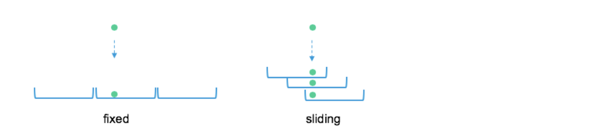
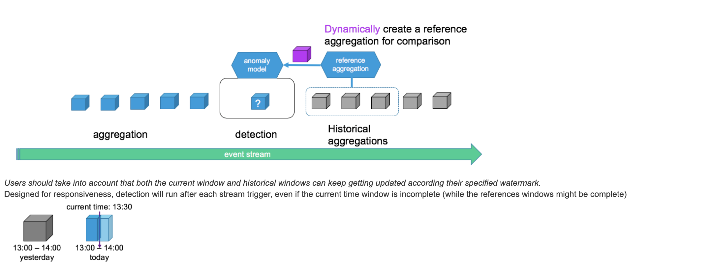

<!--
 Copyright 2019 PayPal Inc

  Licensed under the Apache License, Version 2.0 (the "License");
  you may not use this file except in compliance with the License.
  You may obtain a copy of the License at

      http://www.apache.org/licenses/LICENSE-2.0

  Unless required by applicable law or agreed to in writing, software
  distributed under the License is distributed on an "AS IS" BASIS,
  WITHOUT WARRANTIES OR CONDITIONS OF ANY KIND, either express or implied.
  See the License for the specific language governing permissions and
  limitations under the License.
-->

# Overview

The main component of the anomaly detection framework. The pipeline contains the logical definitions of the pipeline components (not the the actual computation).

```
/**
 * a container class for defining anomaly detection pipeline components
 * @param colKey         name of the column to be tracked by this pipeline
 * @param windowStrategy defines how to window the data stream
 * @param windowRefStrategy defines which windows a the detection model will use as reference
 * @param aggrFactory  used for creating new data windows
 * @param anomalyModel   model for deciding when data in a window is considered an anomaly
 */
case class AnomalyPipeline(colKey: String,
  windowStrategy: WindowStrategy,
  windowRefStrategy: WindowRefStrategy,
  aggrFactory: DataAggregationFactory,
  anomalyModel: DetectionModel)
```

Pipelines can be created directly or with a builder. The builder is just syntactic sugar for creating multiple pipelines:

```
val categoricalPipe = PipelineBuilder()
  .onColumns(...)
  .setWindowing(...)
  .setWindowReferencing(...)
  .buildModel(...)
```
# Windowing

| type | example | description |
|------|---------|-------------|
|Global Window| Window.global| A single bucket for all events|
|Fixed Windows| Window.fixed(“1 hour”)|Creates windows of fixed duration (no overlap)|
|Sliding Window|Window.sliding(“1 hour”, “10 minutes”)|Creates a sliding window of fixed size, sliding every specified duration (with overlap)|

*Fixed windows are the best practice for production since Events will get replicated for each window slide they belong to. Small sliding steps can have a significant performance impact*



*User can also create their own custom windowing by extending the WindowStrategy trait.*

# Aggregation

An aggregation is made of 2 complimentary classes:

Aggregation: the aggregation data structure that will process each window in the pipeline
Aggregation Factory: initializes a new aggregation in each new window that is detected


The design allows to create aggregations in many different patterns (e.g. sharing state between aggregations).
Aggregations contains metadata that contains system and user provided information


Creating custom aggregations by extending this trait:

```
/** factory for creating new data aggrs */
trait DataAggregationFactory extends Serializable {
 
  /** creates a new data aggr when required by window strategy */
  def createNewAggregation(): DataAggregation
}
 
/** modeling of the data inside each window, can contain any custom logic */
trait DataAggregation extends Serializable {
 
  val metadata = new mutable.HashMap[String, String]()
 
  /** adds a new metric observation to the aggr, no order of metrics is guaranteed */
  def update(trackedMetric: TrackedMetric): Unit
 
  /**
   * cleans and compacts unneeded state,
   * can be used after detection or in the future automatically at the background
   */
  def cleanAndCompact(): Unit = {}
}
```

# Window Reference

Many times it is not possible to classify anomalies by absolute definitions therefore intuitively we say an anomaly is "an observation that is significantly different from what we expected".
Since anomalies can have many different patterns we would need a mechanism that can understand the historical behavior of the data taking into account seasonality and trend.

Window Reference allows us to have strategies for selecting historical windows as reference data when we evaluate if a the current window is anomalous.

___There are different built-in referencing strategies:___

|type|example|Canned options|
|----|-------|--------------|
|No reference|WindowReference.NOREF|NOREF|
|Single reference|WindowReference.SingleRef.singleWindowBeforeDuration(“24 hours”)|lastWindow <br>previousNthWindow <br> singleWindowBeforeDuration|
|Multiple references|WindowReference.MultiRef.allWindowsInLastDuration(“24 hours”)|allWindowsInLastDuration <br> lastNWindows <br> dailyWindows <br> windowsBetweenTs <br> recurringInterval <br> recurringDuration <br>|


Users can add custom reference strategies by extending the WindowRefStrategy trait

Reference Watermark: since historical references consume application resource we follow the stream processing paradigm and remove them from memory according to a watermark. By default the global watermark of the dataset is used however we also enable fine tuning the watermark per metric.

It is also possible to add data from the current window that is being evaluated can also be part of the reference windows.

```
// choose ref strategy
val ref = WindowReference.MultiRef.allWindowsInLastDuration("1 hour")
 
// specify reference watermark
val wref = ref withWatermark "2 hours"
 
// include current window in the reference
val iref = ref includeCurrentWindowInRef
```
# Anomaly Detection Model 

Compares current window aggregation with selected reference windows and detect anomalies, the model can also produce intermediate result (e.g. the root cause of the anomaly).

More on models types can be found in the ___Models___ section.



Creating custom models by extending this trait:

```
/** modeling of when a data window model is considered an anomaly, can contain any custom logic */
trait DetectionModel extends Serializable {
 
  /** checks if aggr contains anomaly, None results are ignored */
  def detect(aggr: DataAggregation, refAggr: Seq[DataAggregation]): Option[Report]
}
```
# Report

The output of an anomaly detection analysis, produced when examining each latest aggregation. The report interface is completely flexible and can contain any information required for post processing and extracting insights.
Reports contain also metadata from the processing flow like what is the current time window and which windows were selected as references for the model.


Creating custom reports by extending this trait:
```
/** response of the anomaly model check, even if no anomaly was detected, can have any logic */
trait Report extends Serializable {...}
```
