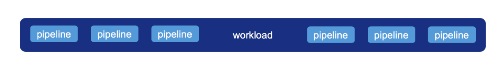

<!--
 Copyright 2019 PayPal Inc

  Licensed under the Apache License, Version 2.0 (the "License");
  you may not use this file except in compliance with the License.
  You may obtain a copy of the License at

      http://www.apache.org/licenses/LICENSE-2.0

  Unless required by applicable law or agreed to in writing, software
  distributed under the License is distributed on an "AS IS" BASIS,
  WITHOUT WARRANTIES OR CONDITIONS OF ANY KIND, either express or implied.
  See the License for the specific language governing permissions and
  limitations under the License.
-->

# Overview

The workload is the actual computation that will be executed, multiple pipelines compose a single workload. its possible to control how the workload executes using modes:

Full history scan: will check for anomalies in all windows in the system including historical windows (that haven't been cleared by a watermark). This is useful for running in batch mode for research.
Detection on window end: will execute anomaly detection on a window only when it ends, this is different then the default behavior that will check for anomaly in the latest window at each trigger. A window "end" is defined as the time when a later window was detected. e.g. for fixed 1 hour windows, the first event in window 15:00-16:00 (or later) will trigger anomaly detection on window 14:00-15:00



Creating the workload:
```
// compose the workload to process
val workload = AnomalyWorkload.builder()
  .addAllPipelines(pipelines)
  .buildWithWatermark("timestamp", "2 hours")
 
// activating anomaly detection on all windows
val fullScan = workload.withFullHistoryScan
 
// activating anomaly detection only on window end
val windowEndWorkload = workload.withDetectionOnWindowEnd
```
# Metric Sharding

In some cases a pipeline of a certain metric cannot naively execute efficiently in a production setting. The cause for that will usually be if an aggregation with its reference history consumes too much memory (memory bound) or the computation of the model takes too long (compute bound).
E.g. a metric that checks the distribution of users IP address. For such scenarios we exposed an API to scale-out a pipeline to multiple sub-pipelines, sharding the data and the computation to execute in parallel.

```
// compose the workload to process a column with pipeline sharding
val workload = AnomalyWorkload.builder()
  .addAllPipelines(pipelines)
  .addPartitioner("some_column")
  .buildWithWatermark("timestamp", "2 hours")
```
Once a partitioner was defined on a column, all pipelines that use this column will be sharded.


